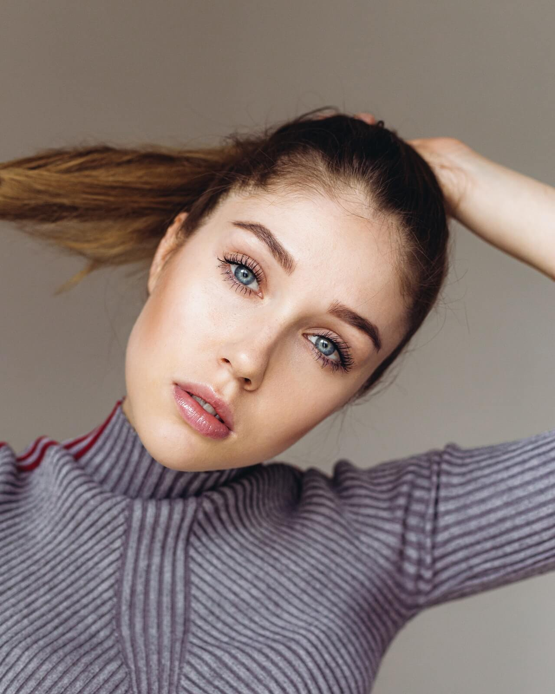
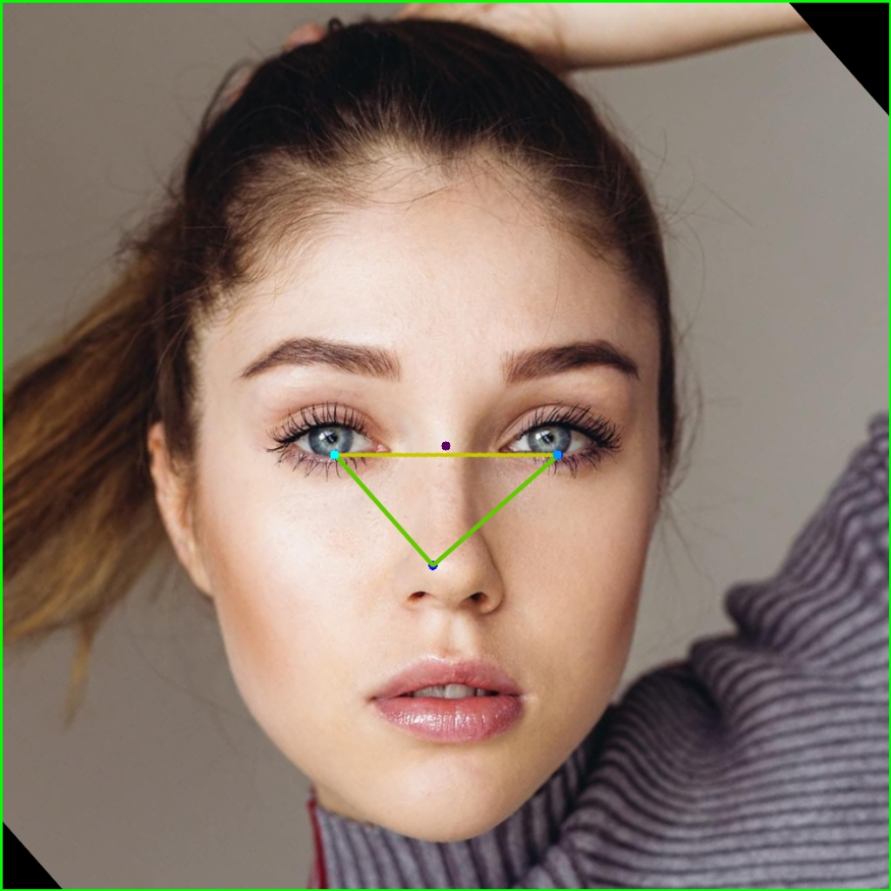
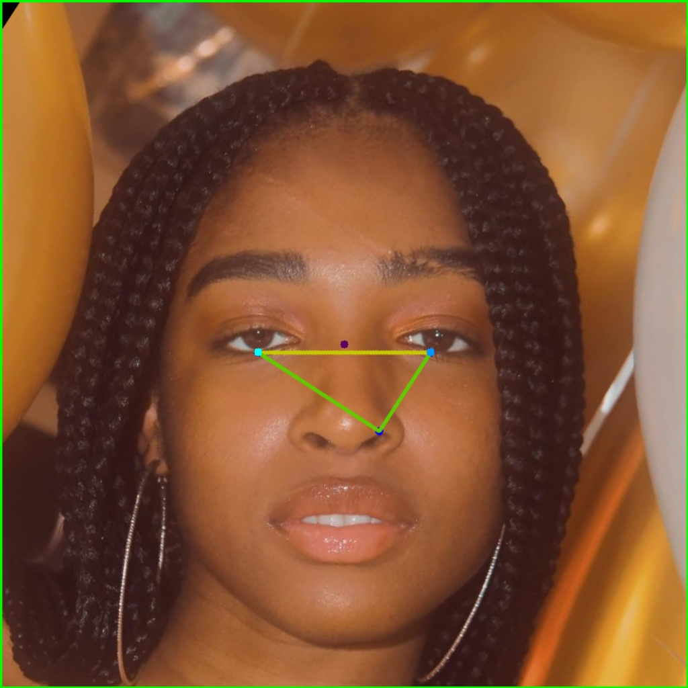
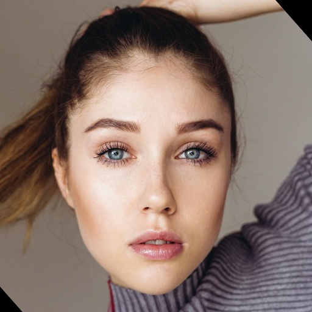
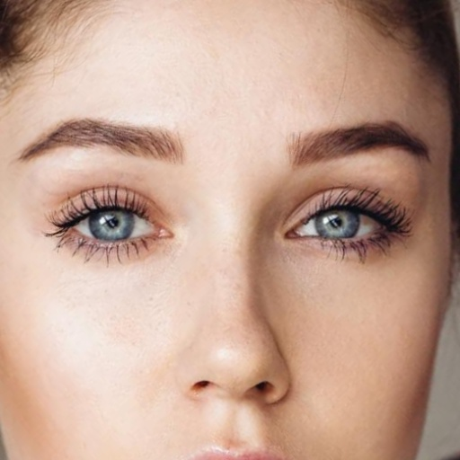
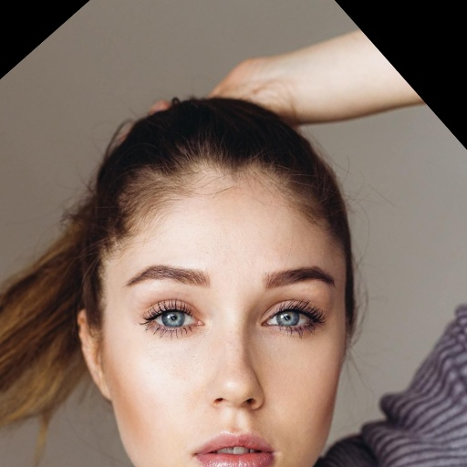

# FaceTool

A simple python package to crop and align faces. Uses Mediapipe for face detection

|Input |Output|
--- | --- |
|||
|||
---
|Output |ZoomFactor 1| ZoomFactor 4| Offset -200|
--- | --- | --- | ----
||||
---
## Usage

```PYTHON
facetool = FaceTool(debug=False)
#Crop and Align, Returns 3 Parameters (face_count, faces array)
face_count, faces, message = facetool.crop_and_align(image, size=512, zoom_factor=2, offset_y=-10)

if face_count > 0:
    # face are sorted by area
    # takes the face with largest area.
    cv2.imshow("cropped_image_0", faces[0].image)
```

---
Acknowledgements
----------------
The alignment code is partially Based on the tutorial by [datahacker.rs](http://datahacker.rs/010-how-to-align-faces-with-opencv-in-python/)

This repository contains some stock photos from [Pexels].

[Pexels]: https://www.pexels.com/